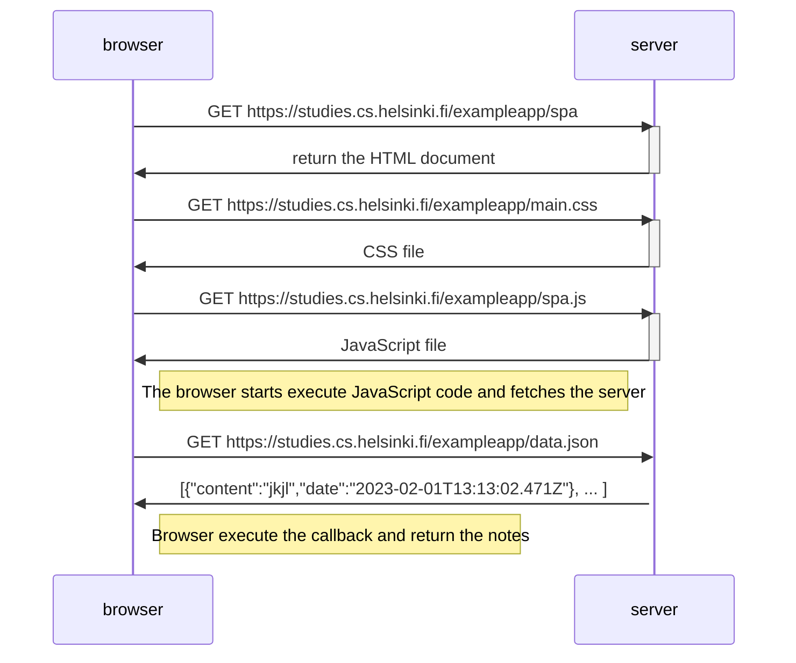

```mermaid
sequenceDiagram
  participant browser
  participant server
    
  browser->>server: GET https://studies.cs.helsinki.fi/exampleapp/spa
  activate server
  server->>browser: return the HTML document
  deactivate server
  
  browser->>server: GET https://studies.cs.helsinki.fi/exampleapp/main.css
  activate server
  server->>browser: CSS file
  deactivate server
  
  browser->>server: GET https://studies.cs.helsinki.fi/exampleapp/spa.js
  activate server
  server->>browser: JavaScript file
  deactivate server
  
  Note right of browser: The browser starts execute JavaScript code and fetches the server
  
  browser->>server: GET https://studies.cs.helsinki.fi/exampleapp/data.json
  activate server
  server->>browser: [{"content":"jkjl","date":"2023-02-01T13:13:02.471Z"}, ... ]
  
  Note right of browser: Browser execute the callback and return the notes
```
