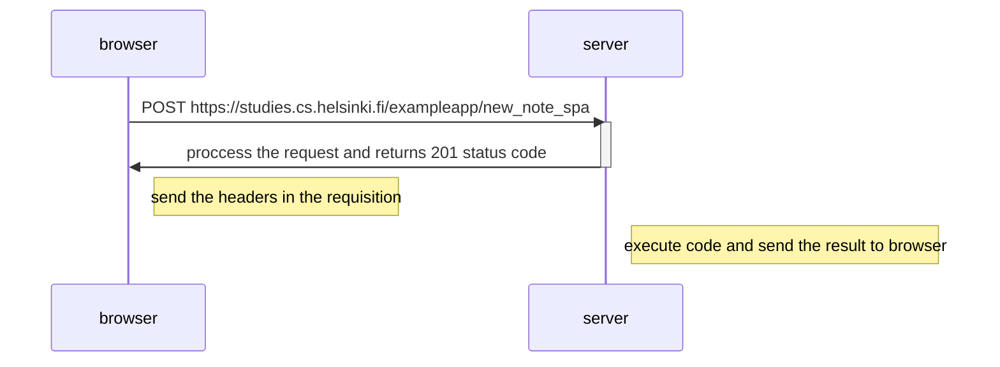

```mermaid
sequenceDiagram
  participant browser
  participant server
  
  browser->>server: POST https://studies.cs.helsinki.fi/exampleapp/new_note_spa
  activate server
  server->>browser: proccess the request and returns 201 status code
  deactivate server
  
  Note right of browser: send the headers in the requisition
  Note right of server: execute code and send the result to browser
```
